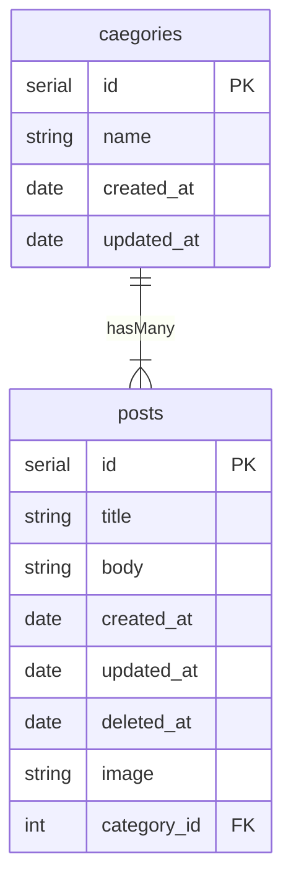

## ✅ この記事の目的

「1+Nクエリ問題」の説明とその対処法の一つである「Eagerローディング」をきちんと理解して意識的に使えるようになること

## 環境

```sh
$ php artisan -V
Laravel Framework 6.20.44
```

一部Laravelのダンプ結果を掲載しているのでここで環境を明示していますが，内容としてはこのバージョンでなくても，Laravelでなくても共通するものが多いと思います．

## 前準備

一般的なブログアプリを想定します．
1つの投稿（post）は必ず1つのカテゴリー（category）に属しており，1つのカテゴリー（category）には複数の投稿（posts）があります．

### リレーション



### 投稿一覧画面の表示内容

全てのカテゴリーの投稿一覧を表示したいとします．
以下のようなイメージです．

```txt
-----------------------------------
| ## title7
| this is body7
| created_at: 2022-04-18 22:28:49
| image: 〇
| category: hobby
-----------------------------------

-----------------------------------
| ## title6
| this is body6
| created_at: 2022-04-17 12:11:37
| image: ▲
| category: job
-----------------------------------

-----------------------------------
| ## title5
| this is body5
| created_at: 2022-04-16 16:18:01
| image: □
| category: job
-----------------------------------

...
```

## 1+N問題とEagerローディング

上記を作るにあたり，**どのような問題が生じ，どのように対処できるのか**を説明していきます．

### Eloquent（LaravelのORM）の落とし穴

LarevelはPHPのフレームワークです．フレームワークは一般的なアプリ開発に必要なプロセスを効率的かつ安全に構築するための強力なツールを提供してくれています．
その中でもEloquent（LaravelのORM）はLaravelを特徴づける機能の一つで，データベースのテーブルとPHPのオブジェクトを対応付けることで，データベース操作の抽象度を高め，変更容易性のあるコードが書きやすくなるというのが大きなメリットです．

ただし，

⚠️ その抽象度の高さゆえに，実際にどのようなデータベースアクセスが発生しているのか見えにくくなってしまうという落とし穴もあると思います．

ORMはこのデメリットをおして余りあるメリットが存在するため，様々なフレームワークで採用されていますが，**この落とし穴の存在をしっかり理解したうえで使用する必要があります．**

### 1+N問題

この落とし穴の一つが1+N問題です．
前準備の内容を思い出してください．投稿一覧画面の各投稿には，その投稿が属するカテゴリーの名前が表示されています．これを実現しようとする場合，どのようにEloquentを利用すれば良いかを考えます．

まずは，postsテーブルのデータを全て取得してくる必要があります．[^1]
[^1]: Postクラスは，Eloquentの機能を提供するModelクラスを継承しているものとします．

```php
$post = new Post();
$posts = $post->all();
```

これで`$posts`には，postsテーブルのデータが全て入っていることになります．
このデータをフロントに渡して投稿の一覧を表示します．

```html
@foreach ($posts as $post)
<div>
    <h1>## {{ $post->title }}</h1>
    <p>{{ $post->body }}</p>
    image }}">
    <span>created_at: {{ $post->created_at }}</span>
    <span>category: {{ $post->category->name }}</span>
</div>
@endforeach
```

ここで，「データベースへのアクセス回数」に注目して，データ取得から表示までの流れを見直してみます．

まず初めの`$post = new Post();`が，ここではデータベースへのアクセスは発生していません．
次の`$posts = $post->all();`で初めてpostsテーブルのデータを全て取得するために**1回**データベースへのアクセスが行われています．

そして，フロントでカテゴリー名を表示する`$post->category->name`の部分でも，**各投稿につき1回**データベースへのアクセスが行われています．

これは，1つ前の`$posts`を分解した`$post`の中にある`category_id`のデータをもとに，categoriesテーブルのデータからカテゴリー名を取得してくる必要があるためです．
この部分がEloquentによって隠されて，気づきづらくなっています．

そして，この**各投稿につき1回**というのが問題になります．

なぜなら，投稿データの個数と共に，データベースアクセスの回数も増大するからです．もし，投稿データが数件しかないのであれば，これは特に問題にはなりません．

しかし，1,000,000件あったらどうでしょう？

初めに`$posts = $post->all();`の部分で，**1回**，`$post->category->name`の部分で**1,000,000回**，合計1,000,001回のデータベースアクセスが必要になります．これでは，一覧表示するのに時間がかかりユーザーが離脱してしまうかもしれません．

素のSQLで表すと以下のようになります．

```sql
select * from posts -- $post->all()
/* foreach内 */
select name from categories where id = 1 -- $post->category->name
select name from categories where id = 2 -- $post->category->name
select name from categories where id = 3 -- $post->category->name
.
.
.
select name from categories where id = 1000000 -- $post->category->name
```

⚠️ N個の投稿データでは，1+N回のデータベースアクセスが必要になることから，これを1+N問題と呼びます[^2]．

[^2]: N＋1問題ということもありますが，データベースアクセスの流れを考えると，私は1+N問題の方がしっくる気がします．

この問題を解消しようとしたらどのような実装をすればいいでしょうか？
・
・
・
フロントに渡して，1つ1つの投稿に分解する前に**あらかじめ**それに紐づくカテゴリーのデータもまとめて取得出来たらよさそうな気がします．

これを実現してくれるのが**Eager（せっかちな，熱心な）ローディング**です．

## Eagerローディングの正体

実際にEagerローディングによってデータを取得してみましょう．以下のような変更を加えます．

```diff
- $posts = $post->all();
+ $posts = $post->with('category')->all();
```

修正自体はこれだけで完了です（少ない変更で済むのはEloquentの利点ですね）．しかし，これではEagerローディングが1+N問題を軽減できる理由がよくわからないので，取得結果の中身を覗いて比較してみましょう．

Laravelには`dd`という便利なヘルパ関数が用意されており，`dd`を使用した時点で処理をストップして，引数に与えられた式や変数のその時点での中身を表示してくれます．以下のように使ってみましょう．

```php
dd($post->all(), $post->with('category')->all());
```

これによって，Eagerローディングを使用していない場合（`$post->all()`）と使用した場合（`$post->with('category')->all())`）の結果を比較できます．

以下が出力結果です．上側がEagerローディングを使用していない場合（`$post->all()`），下側が使用した場合（`$post->with('category')->all())`）です．


画像は投稿データが8個の場合のもので，インデックスが0のitemの中身を展開表示しています．
双方で共通している部分は`items.attributes`の部分で，こちらには，1つの投稿データが入っています．
異なる部分は`items.relations`の部分です．**上側は空の配列**になっていますが，**下側は複数のプロパティ**があり，`items.relations.attributes`には紐づいたカテゴリーのデータが取得できているのが分かります．

これがEagerローディングの正体です．

この段階で紐づくカテゴリーの名前（`name`）が取得できているので，`$post->category->name`の部分では，`items.relations.attributes.name`を参照するだけでよく，**データベースアクセスは発生しません**．

ただし，1回で紐づくカテゴリーの名前まで取得できているわけではなく，postsテーブルのデータをすべて取得するために1回，それに紐づくcategoriesテーブルのデータをすべて取得するために1回，合計で2回のデータベースアクセスが必要です．

素のSQLで表すと以下のようになります．

```sql
/* $post->with('category')->all()) */
select * from posts
select * from categories where id in (1, 2, 3, ..., 1000000)
```

これにより，

⭐ Eagerローディングをすると1,000,000件のデータに対して1,000,001回必要だったデータベースアクセスを2回[^3]に抑えることができました．

[^3]: 通常の`$post->all()`は，Eagerロードに対して，遅延ロードと呼ばれており，`select * from posts`のみが実行されているため，データベースアクセスは1回であり，この時点ではEagerローディングの方が1回多くデータベースにアクセスしています．このことから，常にEagerローディングをする方が良いというわけではなく，リレーション先のデータを表示したい場合などに意識的に利用する必要があります．

## おわりに

1+N問題は，個人開発のような小規模なアプリではあまり問題になることはありませんが，大規模なアプリに与える影響は甚大なので，それの対応策であるEagerローディングをきちんと理解して，意識的に使っていくことが重要だと思います．

## ℹ️ 参考

https://readouble.com/laravel/6.x/ja/eloquent-relationships.html#eager-loading
