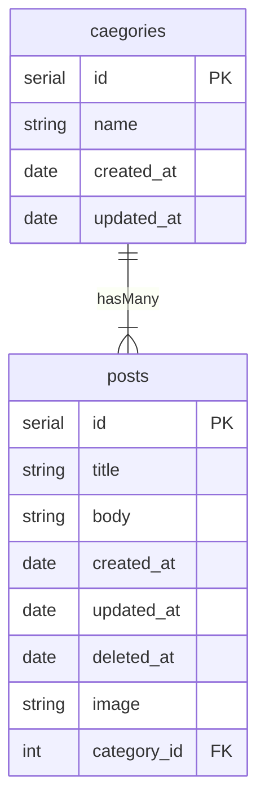

# はじめに
ときどき，プログラミングスクールの生徒の方から，「Eagerローディングとは何ぞや」という質問が来ることがあるので，ここらで記事として整理しておこうと思います．
# 対象
::: message
- Eagerローディング，1+N問題について理解したい方
- Eagerローディングが1+N問題を軽減できる理由を理解したい方
- そのうち忘れるであろう自分
:::
# 環境
```
$ php artisan -V
Laravel Framework 6.20.44
```
この記事ではなるべく文法にとらわれないように，コードを少なくして書いているので，Laravelに関する知識と経験があまりなくても問題ありませんが，Laravelが採用しているMVCアーキテクチャの知識を前提とした表現が一部あるので，こちらについて詳しく知りたい方は以下の記事をご覧ください．
https://zenn.dev/souhal/articles/b07adc15209ab5
# 前提条件
一般的なブログアプリを想定してください．
1つの投稿（post）は必ず1つのカテゴリー（category）に属しており，1つのカテゴリー（category）には複数の投稿（posts）があります．
## ER図

## UI
全てのカテゴリーの投稿一覧を表示したいとします．
以下のようなイメージです．
```md:UI
-----
# title7
this is body7
created_at: 2022-04-18 22:28:49
image: 〇
category: hobby
-----

-----
# title6
this is body6
created_at: 2022-04-17 12:11:37
image: ▲
category: job
-----

-----
# title5
this is body5
created_at: 2022-04-16 16:18:01
image: □
category: job
-----

・・・
```
::: message
`category`の部分にはその投稿が属するカテゴリーの名前が表示されます．
:::
以上が前提条件です．
# 1+N問題とEagerローディング
こちらを実装していくにあたり，**どのような問題が生じ，どのように対処できるのか**を説明していこうと思います．
## Laravelクエリビルダの落とし穴
まずはじめに，1+N問題が生じうる素地となっているLaravelのクエリビルダについて説明します．
LarevelはPHPのフレームワークです．フレームワークは一般的なアプリ開発に必要なプロセスを効率的かつ安全に構築するための強力なツールを提供してくれます．
このクエリビルダも数ある機能のうちの一つで，簡単なメソッドチェーンで，データベースクエリを自動で作成，実行してくれます．
そして何より，
:::message
データベース操作の抽象度を引き上げることで，メソッドチェーンを変更することなく，様々なデータベースシステムに対応することができる
:::
という，[ETC（Easier To Change）原則](https://pragprog.com/tips/#:~:text=Good%20Design%20Is%20Easier%20to%20Change%20Than%20Bad%20Design)に則った，開発者にとってとても素晴らしい機能となっています．

ただ，
:::message alert
その抽象度の高さゆえに，実際にどのようなデータベースアクセスが発生しているのか見えにくくなってしまうという落とし穴が存在します．
:::
クエリビルダはこのデメリットをおして余りあるメリットが存在するため，様々なフレームワークで採用されていますが，**この落とし穴の存在をしっかり理解したうえで使用する必要があります．**
## 1+N問題
この落とし穴の一つが1+N問題です．
前提条件を思い出してください．UIには投稿一覧が表示されており，各投稿には，その投稿が属するカテゴリーの名前が表示されています．これを実現しようとする場合，どのようにクエリビルダを利用すればいいでしょうか？こちらを順に考えていきましょう．
まずは，postsテーブルのデータを全て取得してくる必要があります．そのためにPostクラス[^1]をインスタンス化します．
[^1]: Modelクラスは，クエリビルダとしても動作し，PostクラスはそのModelクラスを継承しています．
```php
$post = new Post();
```
そして，`get`メソッドをチェーンすることで，テーブルのデータを全て取得することができます．
```php
$posts = $post->get();
```
これで`$posts`には，postsテーブルのデータが全て入っていることになります．
このデータをUIに渡して投稿の一覧を表示します．
```html:UI
@foreach ($posts as $post)
<div>
    <h1># {{ $post->title }}</h1>
    <p>{{ $post->body }}</p>
    image }}">
    <span>created_at: {{ $post->created_at }}</span>
    <span>category: {{ $post->category->name }}</span>
</div>
@endforeach
```
Laravelのテンプレートエンジンであるviewの記法を一部用いているので，少し説明すると，バックエンドから受け取った`$posts`というデータを`foreach`文に`$post`という名前で一つずつ受け渡して，ループ処理によって一覧表示を実現しています．

ここで，
:::message
データベースへのアクセス回数に注目して今のデータの流れを見直してみましょう．
:::
まず初めの`$post = new Post();`が，ここではデータベースへのアクセスは発生していません．
次の`$posts = $post->get();`で初めてpostsテーブルのデータを全て取得するために**1回**データベースへのアクセスが行われています．

そして，実はUIの部分でカテゴリーの名前を表示する`$post->category->name`の部分でも，**各ループで1回**データベースへのアクセスが行われているのです．
これは，1つ前の`$posts`を分解した`$post`の中にある`category_id`のデータをもとに，categoriesテーブルのデータからカテゴリー名を取得してくる必要があるためです．
この部分がクエリビルダによって隠されて，なかなか見つけづらくなっています．

そして，この**各ループで1回**というのが問題になります．

なぜなら，
ループの回数，つまり，投稿データの個数と共に，データベースアクセスの回数も増大するからです．もし，投稿データが数件しかないのであれば，これは特に問題にはなりません．

しかし，10000件あったらどうでしょう？

初めに`$posts = $post->get();`の部分で，**1回**，`$post->category->name`の部分で**10000回**，合計10001回のデータベースアクセスが必要になります．これでは，一覧表示するのに時間がかかり，UXに悪影響を与えます．
SQL文で表すと以下のようになります．
```sql
select * from posts // $post->get()
/* foreach内 */
select name from categories where id = 1 // $post->category->name
select name from categories where id = 2 // $post->category->name
select name from categories where id = 3 // $post->category->name
.
.
.
select name from categories where id = 10000 // $post->category->name
```
:::message alert
N個の投稿データでは，1+N回のデータベースアクセスが必要になることから，これを1+N問題と呼びます[^2]．
:::
[^2]: N＋1問題ということもありますが，データベースアクセスの流れを考えると，私は1+N問題の方がしっくりきます

この問題を解消しようとしたらどのような実装をすればいいでしょうか？
・
・
・
UIに渡して，1つ1つの投稿に分解する前に**あらかじめ**それに紐づくカテゴリーのデータもまとめて取得出来たらよさそうですよね？

これを実現するのが**Eager（せっかちな，熱心な）ローディング**なのです．
# Eagerローディングの正体
実際にEagerローディングによってデータを取得してみましょう．以下のような変更を加えます．
```diff php
- $posts = $post->get();
+ $posts = $post->with('category')->get();
```
実装自体はこれだけで完了です．しかし，これでは，Eagerローディングが1+N問題を軽減できる理由がよくわからないので，取得結果の中身を覗いて比較してみましょう．

Laravelには`dd`という便利なヘルパ関数が用意されており，`dd`を使用した時点で処理をストップして，引数に与えられた式や変数のその時点での中身を表示してくれます．以下のように使ってみましょう．
```php
dd($post->get(), $post->with('category')->get());
```
これによって，Eagerローディングを使用していない場合（`$post->get()`）と使用した場合（`$post->with('category')->get())`）の結果を比較できます．

以下が出力結果です．上側がEagerローディングを使用していない場合（`$post->get()`），下側が使用した場合（`$post->with('category')->get())`）です．

画像は投稿データが8個の場合のもので，インデックスが0のitemの中身を展開表示しています．
双方で共通している部分は`items.attributes`の部分で，こちらには，1つの投稿データが入っています．
異なる部分は`items.relations`の部分です．**上側は空の配列**になっていますが，**下側は複数のプロパティ**があり，`items.relations.attributes`には紐づいたカテゴリーのデータが取得できているのが分かります．

これがEagerローディングの正体です．

この段階で紐づくカテゴリーの名前（`name`）が取得できているので，`$post->category->name`の部分では，`items.relations.attributes.name`を参照するだけでよく，データベースアクセスは発生しません．

ただし，1回で紐づくカテゴリーの名前まで取得できているわけではなく，postsテーブルのデータをすべて取得するために1回，それに紐づくcategoriesテーブルのデータをすべて取得するために1回，合計で2回のデータベースアクセスが必要です．
SQL文で表すと以下のようになります．
```sql
/* $post->with('category')->get()) */
select * from posts
select * from categories where id in (1, 2, 3, ..., 10000)
```
これにより，
:::message
Eagerローディングをすると10000件のデータに対して10001回必要だったデータベースアクセスを2回[^3]に抑えることができました．
:::
[^3]: 通常の`$post->get()`は，Eagerロードに対して，遅延ロードと呼ばれており，`select * from posts`のみが実行されているため，データベースアクセスは1回であり，この時点ではEagerローディングの方が1回多くデータベースにアクセスしています．このことから，常にEagerローディングをする方が良いというわけではなく，リレーション先のデータを表示したい場合などに意識的に利用する必要があります．
# おわりに
1+N問題は，個人開発のような小規模なアプリではあまり問題になることはありませんが，大規模なアプリに与える影響は甚大なので，それの対応策であるEagerローディングをきちんと理解して，意識的に使っていくことが重要だと思います．

では，

# 参考
https://readouble.com/laravel/6.x/ja/eloquent-relationships.html#eager-loading
